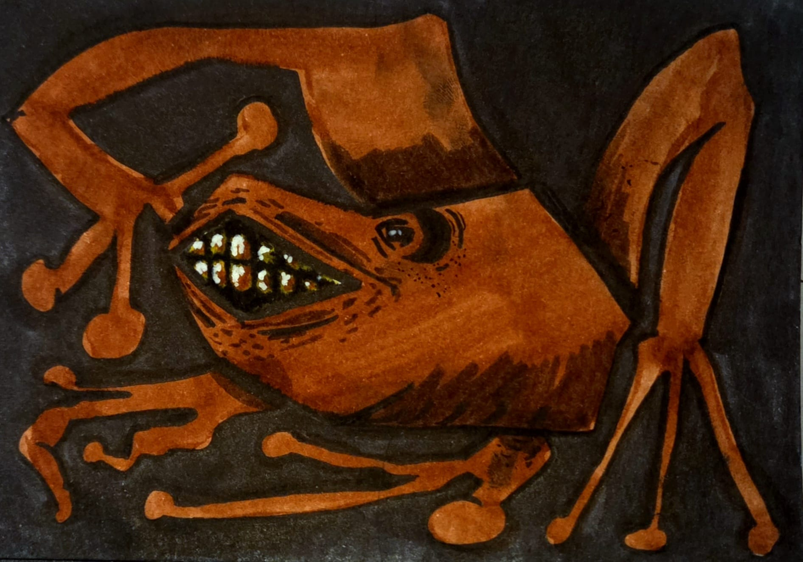

# 🆘 SOLUCIÓN DE PROBLEMAS - FAQ

## 🔴 ERRORES MÁS COMUNES Y SOLUCIONES

## 1. "Connection refused" o "SQLSTATE[HY000]"

**Síntoma:**
```
Fatal error: Uncaught exception 'PDOException' with message 'SQLSTATE[HY000]: General error: 2002 No such file or directory'
```

**Causas:**
- MySQL no está iniciado
- Datos de conexión incorrectos en `config/database.php`
- Base de datos no existe

**Solución:**

```bash
# 1. Abre XAMPP Control Panel
# 2. Haz clic en "Start" en MySQL
# 3. Espera a que aparezca en verde

# 4. Verifica que está corriendo:
# - Ve a http://localhost/phpmyadmin
# - Debería abrir phpMyAdmin
```

Si sigue sin funcionar:

```php
// En config/database.php, verifica:
$pdo = new PDO(
    "mysql:host=localhost;dbname=galeria_arte;charset=utf8mb4",
    "root",    // ← Usuario (generalmente 'root')
    ""         // ← Contraseña (vacía por defecto)
);

// Si el puerto es diferente:
$pdo = new PDO(
    "mysql:host=localhost:3306;dbname=galeria_arte;charset=utf8mb4",
    "root",
    ""
);
```

---

## 2. "Table 'galeria_arte.obras' doesn't exist"

**Síntoma:**
```
Error: Table 'galeria_arte.obras' doesn't exist
```

**Causa:**
La base de datos existe pero no tiene las tablas.

**Solución:**

```bash
# 1. Abre phpMyAdmin (http://localhost/phpmyadmin)
# 2. Haz clic en "galeria_arte"
# 3. Ve a la pestaña "SQL"
# 4. Copia todo el contenido de database.sql
# 5. Pégalo y haz clic en "Ejecutar"
```

O importa directamente:

```bash
# 1. En phpMyAdmin, haz clic en "galeria_arte"
# 2. Ve a "Importar"
# 3. Selecciona el archivo database.sql
# 4. Haz clic en "Ejecutar"
```

---

## 3. "Access denied for user 'root'@'localhost'"

**Síntoma:**
```
SQLSTATE[HY000] [1045] Access denied for user 'root'@'localhost'
```

**Causa:**
- Contraseña incorrecta en `config/database.php`
- Usuario incorrecto

**Solución:**

En XAMPP, por defecto:
- Usuario: `root`
- Contraseña: vacía (no poner nada)

```php
// CORRECTO en XAMPP:
$pdo = new PDO(
    "mysql:host=localhost;dbname=galeria_arte;charset=utf8mb4",
    "root",    // Usuario por defecto
    ""         // SIN contraseña
);
```

Si lo instalaste con contraseña:

```php
// Si tienes contraseña personalizada:
$pdo = new PDO(
    "mysql:host=localhost;dbname=galeria_arte;charset=utf8mb4",
    "root",
    "tu_contraseña_aqui"  // Pon tu contraseña
);
```

---

## 4. Página completamente blanca (White Screen of Death)

**Síntoma:**
- Abre la página pero no muestra nada
- No hay error visible

**Causa:**
- Error crítico en PHP pero no se muestra

**Solución:**

```bash
# 1. Abre el navegador (F12)
# 2. Ve a "Console"
# 3. Busca errores rojos

# Si no ve nada:
# 4. Ve a C:\xampp\apache\logs\error.log
# 5. Abre con Notepad
# 6. Busca los últimos errores (abajo del archivo)
```

O habilita mostrar errores:

```php
// Al inicio del archivo PHP:
ini_set('display_errors', 1);
ini_set('display_startup_errors', 1);
error_reporting(E_ALL);
```

---

## 5. Las imágenes no aparecen

**Síntoma:**
- Ve las obras pero no aparecen las imágenes
- Solo ve un cuadro quebrado

**Causas:**
- Archivos no están en `/fotos/`
- Ruta en la base de datos es incorrecta
- Permiso de carpeta

**Solución:**

Paso 1: Verifica que las imágenes existen

```bash
# 1. Abre C:\xampp\htdocs\PHP_ART\fotos\
# 2. Debería ver archivos como:
#    - 1000085550.jpg
#    - 1000085553.jpg
#    etc.

# Si no están:
# 3. Copia imágenes JPG a esta carpeta
```

Paso 2: Verifica la ruta en la BD

```sql
-- En phpMyAdmin, ejecuta:
SELECT id, titulo, imagen FROM obras;

-- Debería mostrar:
-- 1 | Atardecer | fotos/1000085550.jpg
-- 2 | Flores | fotos/1000085553.jpg
-- Etc.

-- Si está mal, actualiza:
UPDATE obras SET imagen = 'fotos/1000085550.jpg' WHERE id = 1;
```

Paso 3: Verifica el HTML

```html
<!-- Debería ser: -->
         <!-- Desde raíz -->
      <!-- Desde subfolder -->

<!-- NO debería ser: -->
  <!-- Absoluto (falla)
           <!-- Windows path (falla)
```

---

## 6. "Undefined variable: _SESSION"

**Síntoma:**
```
Warning: Undefined variable: $_SESSION in header.php on line 4
```

**Causa:**
`session_start()` no se llamó antes de usar `$_SESSION`

**Solución:**

Asegúrate de que `header.php` tiene al inicio:

```php
<?php
// Verificar si sesión está iniciada
if (session_status() === PHP_SESSION_NONE) {
    session_start();
}
// Ahora puedes usar $_SESSION sin problemas
?>
```

---

## 7. "No such file or directory" en includes

**Síntoma:**
```
Warning: include(../config/database.php): Failed to open stream...
```

**Causa:**
Ruta incorrecta del archivo incluido

**Solución:**

Verifica que incluyes desde la carpeta correcta:

```php
// Si el archivo está en: PHP_ART/obras/listar.php
// Y quieres incluir: PHP_ART/config/database.php

// CORRECTO (.. = subir un nivel):
include '../config/database.php';

// Si fuera: PHP_ART/index.php
// CORRECTO (en la raíz):
include 'config/database.php';
```

---

## 8. "Undefined index" en $_GET o $_POST

**Síntoma:**
```
Notice: Undefined index: id in buscar.php on line 10
```

**Causa:**
Intentas acceder a una variable que puede no existir

**Solución:**

Siempre verifica antes:

```php
// MAL (da error si no existe):
$id = $_GET['id'];

// BIEN (seguro):
$id = isset($_GET['id']) ? $_GET['id'] : '';

// O más moderno:
$id = $_GET['id'] ?? '';
```

---

## 9. Login no funciona - "Email o contraseña incorrectos"

**Síntoma:**
- Entra email y contraseña correctos
- Dice que son incorrectos

**Causas:**
- Usuario no existe en BD
- Contraseña no corresponde
- Encriptación no es correcta

**Solución:**

```sql
-- Verifica que el usuario existe:
SELECT * FROM usuarios WHERE email = 'juan@example.com';

-- Si no aparece, el usuario no existe
-- Debes crearlo

-- Si existe, verifica la contraseña manualmente:
-- (No puedes leerla encriptada, pero puedes hacer login en phpMyAdmin)
```

Si pasaste contraseña como texto plano:

```sql
-- BUSCA ESTO (malo):
password: Password123

-- DEBERÍA SER ESTO (bueno):
password: $2y$10$A3b5c...

-- Si está en texto plano, actualiza:
UPDATE usuarios SET password = PASSWORD('Password123') WHERE id = 1;
-- O mejor aún, usa password_hash en un script PHP
```

---

## 10. Favoritos no persisten (se borran al recargar)

**Síntoma:**
- Añado a favoritos
- Recargo la página
- Desaparece

**Causa:**
Los datos se guardan en `$_SESSION` pero no en la BD

**Solución:**

Verifica que `favoritos/accion.php` guarda en BD:

```php
// Debería tener INSERT o DELETE:
if ($action == 'add') {
    // CORRECTO: Guarda en BD
    $stmt = $pdo->prepare("INSERT IGNORE INTO favoritos (usuario_id, obra_id) VALUES (?, ?)");
    $stmt->execute([$uid, $oid]);
} else {
    // CORRECTO: Borra de BD
    $stmt = $pdo->prepare("DELETE FROM favoritos WHERE usuario_id = ? AND obra_id = ?");
    $stmt->execute([$uid, $oid]);
}

// INCORRECTO: Solo guarda en sesión (se pierde)
$_SESSION['favoritos'][] = $id;
```

---

## 11. "Headers already sent" error

**Síntoma:**
```
Warning: Cannot modify header information - headers already sent
```

**Causa:**
Hay HTML o espacios antes de `<?php` o `header()`

**Solución:**

No puede haber NADA antes del `<?php`:

```php
<!-- INCORRECTO (tiene espacio/salto arriba): -->

<?php
header("Location: index.php");
?>

<!-- CORRECTO (empieza en el inicio): -->
<?php
header("Location: index.php");
?>
```

Incluso espacios invisibles cuentan. Verifica que no haya líneas vacías antes de `<?php`.

---

## 12. CSS y JavaScript no cargan

**Síntoma:**
- Página se ve sin estilos
- Botones no funcionan

**Causa:**
- Ruta incorrecta al CSS
- XAMPP no está iniciado
- Typo en la URL

**Solución:**

Verifica en `header.php`:

```html
<!-- DEBERÍA SER: -->
<link rel="stylesheet" href="/PHP_ART/assets/css/style.css">

<!-- VERIFICAR QUE: -->
<!-- 1. El archivo exista en C:\xampp\htdocs\PHP_ART\assets\css\style.css -->
<!-- 2. El archivo NO esté vacío -->
<!-- 3. El nombre sea exacto (mayúsculas/minúsculas) -->
```

En caso de duda, usa ruta relativa:

```html
<!-- Desde la raíz (index.php): -->
<link rel="stylesheet" href="assets/css/style.css">

<!-- Desde carpeta (obras/listar.php): -->
<link rel="stylesheet" href="../assets/css/style.css">
```

---

## 13. "UNIQUE constraint failed"

**Síntoma:**
```
SQLSTATE[23000]: Integrity constraint violation: 1062 Duplicate entry
```

**Causa:**
Intentaste insertar un valor duplicado en un campo UNIQUE

**Solución:**

```sql
-- En usuarios, email es UNIQUE:
INSERT INTO usuarios (nombre, email, password) VALUES ('Juan', 'juan@test.com', '...');
INSERT INTO usuarios (nombre, email, password) VALUES ('Otro', 'juan@test.com', '...');
-- ^ Error: El segundo Juan@test.com ya existe

-- En favoritos, (usuario_id, obra_id) es UNIQUE:
INSERT INTO favoritos (usuario_id, obra_id) VALUES (1, 5);
INSERT INTO favoritos (usuario_id, obra_id) VALUES (1, 5);
-- ^ Error: El usuario 1 ya tiene la obra 5 como favorita
```

**Solución en PHP:**

```php
// Verificar antes de insertar:
$stmt = $pdo->prepare("SELECT COUNT(*) FROM usuarios WHERE email = ?");
$stmt->execute([$email]);

if ($stmt->fetchColumn() > 0) {
    echo "Email ya existe";
} else {
    // Insertar
}

// O usar INSERT IGNORE (ignora si existe):
$stmt = $pdo->prepare("INSERT IGNORE INTO favoritos (usuario_id, obra_id) VALUES (?, ?)");
$stmt->execute([$uid, $oid]);
```

---

## 14. Lentitud o carga lenta

**Síntoma:**
- La página tarda mucho en cargar
- MySQL está 100% CPU

**Causas:**
- Demasiadas obras en la BD
- Consulta SQL ineficiente
- Sin índices en la BD

**Solución:**

Añade índices:

```sql
-- Índices para búsquedas rápidas:
ALTER TABLE usuarios ADD INDEX idx_email (email);
ALTER TABLE obras ADD INDEX idx_tipo (tipo);
ALTER TABLE favoritos ADD INDEX idx_usuario (usuario_id);
ALTER TABLE favoritos ADD INDEX idx_obra (obra_id);
```

Verifica consultas:

```php
// MAL (trae todo):
$stmt = $pdo->query("SELECT * FROM obras");
$todas = $stmt->fetchAll();

// BIEN (trae solo lo necesario):
$stmt = $pdo->prepare("SELECT id, titulo, precio FROM obras LIMIT 10");
$stmt->execute();
$obras = $stmt->fetchAll();
```

---

## 15. "Allowed memory size exhausted"

**Síntoma:**
```
Fatal error: Allowed memory size of 134217728 bytes exhausted
```

**Causa:**
- Script usa demasiada memoria
- Loop infinito
- `fetchAll()` en tabla muy grande

**Solución:**

En `php.ini` aumenta memoria:

```ini
memory_limit = 256M  ; De 128M a 256M

; En XAMPP está en:
; C:\xampp\php\php.ini
```

O en el código:

```php
ini_set('memory_limit', '256M');

// Usa fetch() en lugar de fetchAll() para datos grandes:
while ($obra = $stmt->fetch()) {
    // Procesar una por una
}
```

---

## 🆘 CHECKLIST DE DEBUGGING

Si algo no funciona:

```
☐ 1. ¿XAMPP está iniciado? (Apache + MySQL en verde)
☐ 2. ¿La BD existe? (Verifica en phpMyAdmin)
☐ 3. ¿Las tablas existen? (SHOW TABLES;)
☐ 4. ¿config/database.php tiene datos correctos?
☐ 5. ¿El usuario existe? (Para login)
☐ 6. ¿Los archivos están en las carpetas correctas?
☐ 7. ¿Las rutas de include son correctas? (../, /, etc)
☐ 8. ¿Hay errores en F12 Console?
☐ 9. ¿Hay errores en error.log?
☐ 10. ¿El código tiene session_start()?
```

---

## 📞 RECURSOS ÚTILES

### Documentación
- PHP: https://www.php.net/manual/es/
- PDO: https://www.php.net/manual/es/book.pdo.php
- MySQL: https://dev.mysql.com/doc/

### Herramientas
- phpMyAdmin: http://localhost/phpmyadmin
- VS Code: https://code.visualstudio.com/
- Postman (para APIs): https://www.postman.com/

### Comunidades
- Stack Overflow (en español): https://es.stackoverflow.com/
- Reddit: r/PHP
- GitHub: Busca repositorios similares

---

**Recuerda:** El 90% de los problemas se resuelven reiniciando XAMPP. 😄
